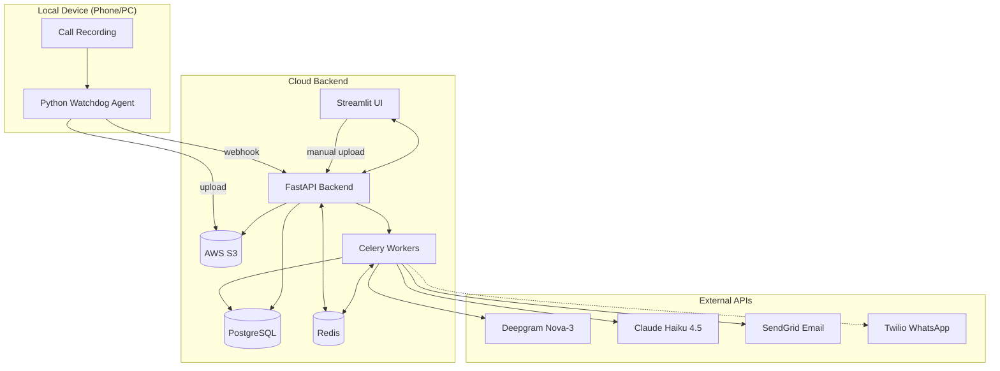
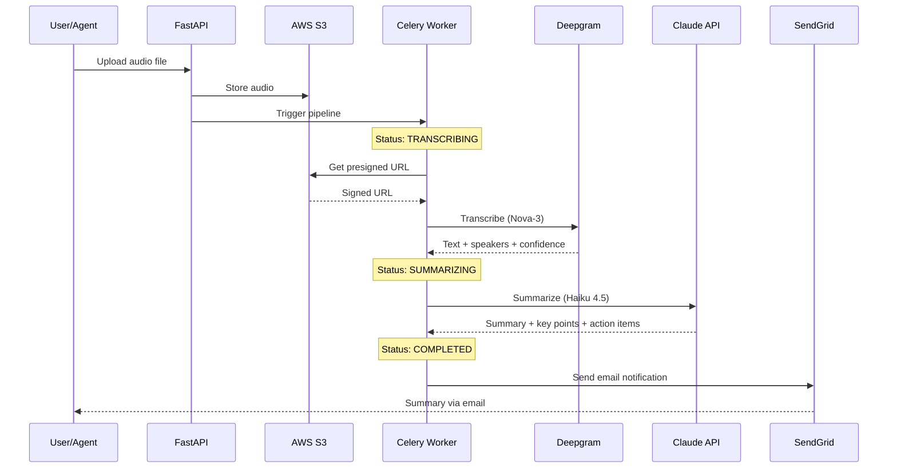
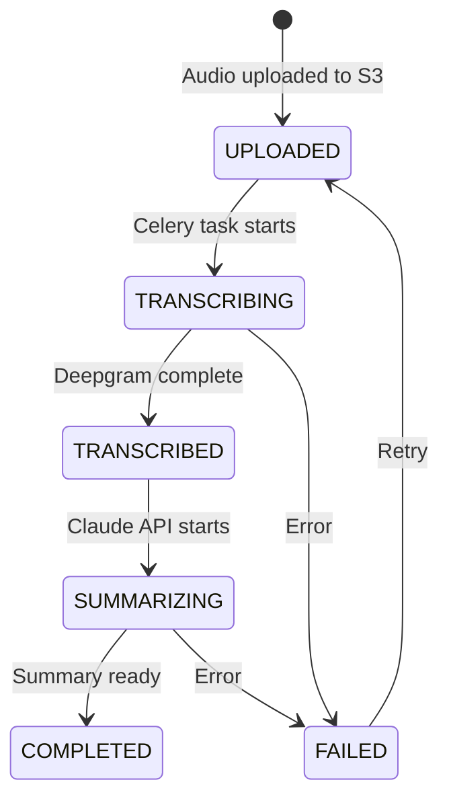
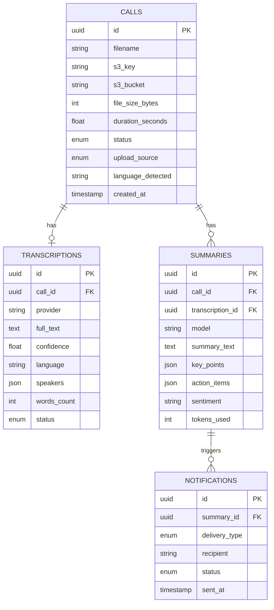

# Calls Summary

Phone call recording transcription & summarization app with automatic upload from local device.

Record calls on your phone or PC, and get automatic transcriptions with AI-powered summaries, key points, action items, and sentiment analysis -- delivered via email or WhatsApp.

## Architecture



## Processing Pipeline



## Call Status Flow



## Database Schema



## Tech Stack

| Component | Technology | Details |
|-----------|-----------|---------|
| Backend | FastAPI (Python 3.11) | Async, auto-docs, Pydantic v2 |
| Frontend | Streamlit | Multi-page UI |
| Database | PostgreSQL 17 | SQLAlchemy 2.0 async |
| Queue | Celery + Redis | Async task pipeline |
| Storage | AWS S3 | Audio file storage |
| Transcription | Deepgram Nova-3 | Speaker diarization, 100+ languages |
| Summarization | Claude Haiku 4.5 | Key points, action items, sentiment |
| Email | SendGrid | Free tier (100/day) |
| WhatsApp | Twilio | Delivery status tracking |
| Local Agent | Python watchdog | Auto-upload from device |

## Quick Start

### Prerequisites

- [Miniconda](https://docs.conda.io/en/latest/miniconda.html) (Python 3.11)
- PostgreSQL 17
- Redis
- API keys: AWS, Deepgram, Anthropic, SendGrid

### Setup

```bash
# 1. Create conda environment
conda env create -f environment.yml
conda activate calls_summery

# 2. Configure environment
cp .env.example .env
# Edit .env with your API keys

# 3. Run database migrations
alembic upgrade head

# 4. Start infrastructure
start.bat    # Starts PostgreSQL + Redis
```

### Run Services

Open 4 terminals:

```bash
# Terminal 1 - Celery worker
conda run -n calls_summery celery -A src.tasks.celery_app worker --loglevel=info --pool=solo

# Terminal 2 - FastAPI backend
conda run -n calls_summery uvicorn src.api.main:app --reload

# Terminal 3 - Streamlit UI
conda run -n calls_summery streamlit run src/app.py

# Terminal 4 - Local agent (auto-upload watcher)
conda run -n calls_summery python -m agent.watcher
```

### Access

- **UI**: http://localhost:8501
- **API docs**: http://localhost:8000/docs
- **Watch folder**: `C:/Users/<you>/CallRecordings`

## Upload Methods

1. **Auto-upload** -- Local agent watches a folder for new recordings, uploads to S3, triggers processing
2. **Manual upload** -- Drag & drop in Streamlit UI, select language, start processing

## Features

- **Transcription** -- Deepgram Nova-3 with speaker diarization (6+ speakers)
- **Summarization** -- Claude Haiku 4.5 generates Hebrew/English summaries
- **Key Points** -- Extracted automatically from conversation
- **Action Items** -- TODO items identified from the call
- **Sentiment Analysis** -- Overall call sentiment
- **Speaker View** -- Conversation displayed per-speaker
- **Download** -- Export summary as `.txt` file
- **Status Tracking** -- Real-time pipeline progress in UI
- **Authentication** -- JWT + API key auth, multi-user support
- **Notifications** -- Email (SendGrid) + WhatsApp (Twilio) with delivery tracking
- **Call Management** -- Reprocess failed calls, delete with S3 cleanup
- **API Key Management** -- Create/revoke keys for local agent setup

## Project Structure

```
calls_summery/
├── src/
│   ├── app.py                    # Streamlit entry point
│   ├── pages/                    # UI pages (auth, upload, calls, summary, settings, notifications, api keys)
│   ├── api/
│   │   ├── main.py               # FastAPI app
│   │   └── routes/               # auth, calls, summaries, settings, notifications, webhooks, api-keys, health
│   ├── models/                   # SQLAlchemy models
│   ├── schemas/                  # Pydantic schemas
│   ├── repositories/             # Data access layer
│   ├── services/                 # Business logic
│   ├── tasks/                    # Celery async tasks
│   ├── config/                   # Settings, logging
│   └── utils/                    # Validators, formatters
├── agent/                        # Local file watcher + S3 uploader
│   ├── watcher.py                # Watchdog observer
│   ├── uploader.py               # S3 upload client
│   └── config.py                 # Agent settings
├── alembic/                      # Database migrations
├── tests/                        # Unit + integration tests
├── docker-compose.yml            # PostgreSQL + Redis
├── environment.yml               # Conda environment
├── start.bat / stop.bat          # Windows service scripts
└── .env.example                  # Environment template
```

## Environment Variables

| Variable | Description | Required |
|----------|-------------|----------|
| `DATABASE_URL` | PostgreSQL connection string | Yes |
| `REDIS_URL` | Redis connection string | Yes |
| `AWS_ACCESS_KEY_ID` | AWS credentials | Yes |
| `AWS_SECRET_ACCESS_KEY` | AWS credentials | Yes |
| `AWS_REGION` | AWS region (e.g. `eu-north-1`) | Yes |
| `S3_BUCKET_NAME` | S3 bucket for audio files | Yes |
| `DEEPGRAM_API_KEY` | Deepgram transcription API | Yes |
| `ANTHROPIC_API_KEY` | Claude summarization API | Yes |
| `SENDGRID_API_KEY` | SendGrid email API | For notifications |
| `TWILIO_ACCOUNT_SID` | Twilio account SID | For WhatsApp |
| `TWILIO_AUTH_TOKEN` | Twilio auth token | For WhatsApp |
| `TWILIO_WHATSAPP_NUMBER` | Twilio WhatsApp sender | For WhatsApp |
| `SECRET_KEY` | JWT signing key (min 32 chars) | Yes |
| `WATCH_FOLDER` | Local folder to watch for recordings | For agent |

## Tests

```bash
# Unit tests
conda run -n calls_summery python -m pytest tests/unit -v

# Integration tests
conda run -n calls_summery python -m pytest tests/integration -v

# All tests with coverage
conda run -n calls_summery python -m pytest tests/unit tests/integration --cov=src --cov-report=term
```

## Estimated API Cost

~$8/month for 100 calls (30 min average):
- Deepgram: ~$0.05/call
- Claude Haiku: ~$0.01/call
- SendGrid: Free tier

## Roadmap

- [x] Manual upload via Streamlit UI
- [x] Deepgram transcription with speaker diarization
- [x] Claude AI summarization (Hebrew + English)
- [x] Speaker conversation view
- [x] Download summary as text
- [x] Local watchdog agent for auto-upload
- [x] Email notifications (SendGrid)
- [x] WhatsApp notifications (Twilio) with delivery tracking
- [x] Settings page for notification preferences
- [x] JWT authentication + API keys (multi-user)
- [x] Login/register UI with auth guards
- [x] API key management UI
- [x] Reprocess failed calls + delete calls
- [x] Input validation (phone, email, language)
- [x] Docker production deployment
- [x] CI/CD pipeline (GitHub Actions)
- [x] Email verification flow
- [x] User plan gating (FREE/PRO/BUSINESS)

## License

Private project.
