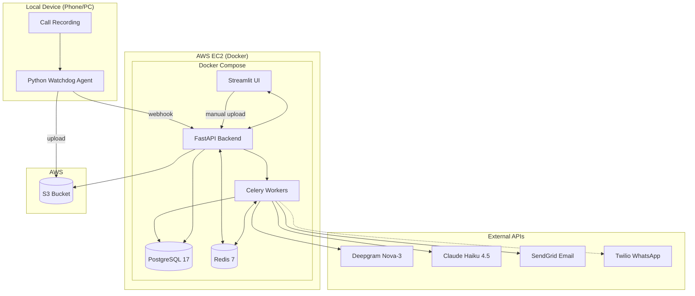
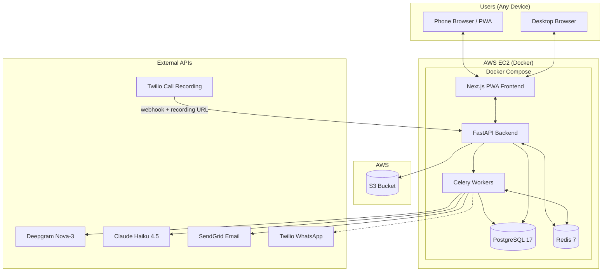
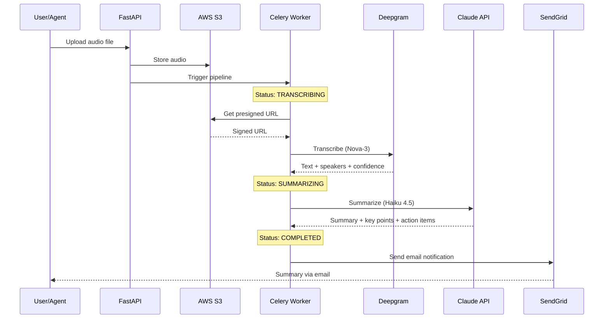
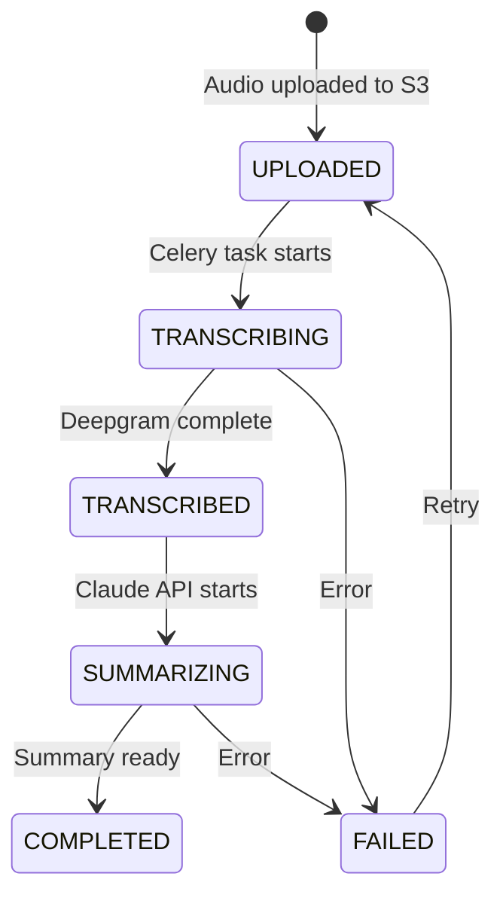
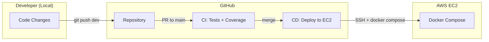

# Calls Summary

Phone call recording transcription & summarization app with automatic upload from local device.

Record calls on your phone or PC, and get automatic transcriptions with AI-powered summaries, key points, action items, and sentiment analysis -- delivered via email or WhatsApp.

## Architecture

### Current (Phase 1-3) -- Hybrid Local + Cloud



### Future (Phase 4) -- Full Cloud, Multi-User



## Processing Pipeline



## Call Status Flow



## Database Schema

```mermaid
erDiagram
    USERS ||--o{ CALLS : owns
    USERS ||--o{ API_KEYS : has
    USERS ||--o| USER_SETTINGS : has
    CALLS ||--o| TRANSCRIPTIONS : has
    CALLS ||--o{ SUMMARIES : has
    TRANSCRIPTIONS ||--o{ SUMMARIES : produces
    SUMMARIES ||--o{ NOTIFICATIONS : triggers

    USERS {
        uuid id PK
        string email UK
        string password_hash
        string full_name
        enum plan "free|pro|business"
        bool is_verified
        bool is_active
        timestamp created_at
        timestamp updated_at
    }

    CALLS {
        uuid id PK
        uuid user_id FK
        string filename
        string original_filename
        string s3_key UK
        string s3_bucket
        int file_size_bytes
        float duration_seconds
        string content_type
        enum status "uploaded|transcribing|transcribed|summarizing|completed|failed"
        enum upload_source "manual|auto_agent|cloud_sync"
        string language_detected
        string error_message
        timestamp created_at
        timestamp updated_at
    }

    TRANSCRIPTIONS {
        uuid id PK
        uuid call_id FK_UK
        string provider "deepgram"
        string external_id
        text text
        float confidence
        string language
        float duration_seconds
        json speakers
        int words_count
        enum status "pending|processing|completed|failed"
        string error_message
        timestamp created_at
        timestamp completed_at
    }

    SUMMARIES {
        uuid id PK
        uuid call_id FK
        uuid transcription_id FK
        string provider "claude"
        string model
        text summary_text
        json key_points
        json action_items
        string sentiment
        string language
        int tokens_used
        enum status "pending|processing|completed|failed"
        string error_message
        timestamp created_at
        timestamp completed_at
    }

    NOTIFICATIONS {
        uuid id PK
        uuid summary_id FK
        enum delivery_type "email|whatsapp"
        string recipient
        enum status "pending|sent|failed|delivered"
        string external_id
        string error_message
        timestamp sent_at
        timestamp created_at
    }

    API_KEYS {
        uuid id PK
        uuid user_id FK
        string name
        string key_prefix
        string key_hash UK
        bool is_active
        timestamp last_used_at
        timestamp created_at
    }

    USER_SETTINGS {
        uuid id PK
        uuid user_id FK_UK
        bool auto_upload_enabled
        string summary_language "auto|he|en"
        string email_recipient
        string whatsapp_recipient
        bool notify_on_complete
        enum notification_method "email|whatsapp|both|none"
        timestamp created_at
        timestamp updated_at
    }
```

## Deployment Architecture



## Tech Stack

| Component | Technology | Details |
|-----------|-----------|---------|
| Backend | FastAPI (Python 3.11) | Async, auto-docs, Pydantic v2 |
| Frontend | Streamlit | Multi-page UI |
| Database | PostgreSQL 17 | SQLAlchemy 2.0 async |
| Queue | Celery + Redis | Async task pipeline |
| Storage | AWS S3 | Audio file storage |
| Transcription | Deepgram Nova-3 | Speaker diarization, 100+ languages |
| Summarization | Claude Haiku 4.5 | Key points, action items, sentiment |
| Email | SendGrid | Free tier (100/day) |
| WhatsApp | Twilio | Delivery status tracking |
| Local Agent | Python watchdog | Auto-upload from device |
| Deployment | Docker Compose on EC2 | Automated via GitHub Actions CI/CD |
| CI/CD | GitHub Actions | Tests on push, deploy on merge to main |

## Quick Start

### Local Development

```bash
# 1. Create conda environment
conda env create -f environment.yml
conda activate calls_summery

# 2. Configure environment
cp .env.example .env
# Edit .env with your API keys

# 3. Run database migrations
alembic upgrade head

# 4. Start infrastructure
start.bat    # Starts PostgreSQL + Redis
```

Open 4 terminals:

```bash
# Terminal 1 - Celery worker
conda run -n calls_summery celery -A src.tasks.celery_app worker --loglevel=info --pool=solo

# Terminal 2 - FastAPI backend
conda run -n calls_summery uvicorn src.api.main:app --reload

# Terminal 3 - Streamlit UI
conda run -n calls_summery streamlit run src/app.py

# Terminal 4 - Local agent (auto-upload watcher)
conda run -n calls_summery python -m agent.watcher
```

### EC2 Production Deployment

```bash
# One-liner setup on fresh Ubuntu 24.04 EC2 instance
curl -sSL https://raw.githubusercontent.com/Ziv1972/calls_summery/main/deploy/setup-ec2.sh | bash

# Configure environment
cd ~/calls_summery
nano .env   # Fill in API keys

# Start all services
docker compose up -d --build

# Check status
docker compose ps
docker compose logs -f
```

Required EC2 security group ports: **22** (SSH), **8001** (API), **8501** (Streamlit UI)

### CI/CD Auto-Deploy

Push to `main` triggers automatic deployment via GitHub Actions:
```bash
git checkout main && git merge dev && git push
```

### Access

| Environment | UI | API Docs |
|---|---|---|
| Local | http://localhost:8501 | http://localhost:8000/docs |
| EC2 | http://EC2-IP:8501 | http://EC2-IP:8001/docs |

## Features

- **Transcription** -- Deepgram Nova-3 with speaker diarization (6+ speakers)
- **Summarization** -- Claude Haiku 4.5 generates Hebrew/English summaries
- **Key Points** -- Extracted automatically from conversation
- **Action Items** -- TODO items identified from the call
- **Sentiment Analysis** -- Overall call sentiment
- **Speaker View** -- Conversation displayed per-speaker
- **Download** -- Export summary as `.txt` file
- **Status Tracking** -- Real-time pipeline progress in UI
- **Authentication** -- JWT + API key auth, email verification
- **User Plans** -- FREE/PRO/BUSINESS tier gating
- **Notifications** -- Email (SendGrid) + WhatsApp (Twilio) with delivery tracking
- **Call Management** -- Reprocess failed calls, delete with S3 cleanup
- **API Key Management** -- Create/revoke keys for local agent setup
- **Docker Deployment** -- Full production stack via Docker Compose
- **CI/CD** -- Automated tests + deploy via GitHub Actions

## Project Structure

```
calls_summery/
├── src/
│   ├── app.py                    # Streamlit entry point
│   ├── pages/                    # UI pages (auth, upload, calls, summary, settings, notifications, api keys)
│   ├── api/
│   │   ├── main.py               # FastAPI app
│   │   └── routes/               # auth, calls, summaries, settings, notifications, webhooks, api-keys, health
│   ├── models/                   # SQLAlchemy models (user, call, transcription, summary, notification, settings, api_key)
│   ├── schemas/                  # Pydantic schemas
│   ├── repositories/             # Data access layer
│   ├── services/                 # Business logic
│   ├── tasks/                    # Celery async tasks
│   ├── config/                   # Settings, logging
│   └── utils/                    # Validators, formatters
├── agent/                        # Local file watcher + S3 uploader
├── deploy/                       # EC2 setup script
├── alembic/                      # Database migrations
├── tests/                        # Unit + integration tests
├── .github/workflows/            # CI (tests) + CD (deploy)
├── docker-compose.yml            # Production stack
├── Dockerfile                    # Multi-service image
├── environment.yml               # Conda environment
├── start.bat / stop.bat          # Windows dev scripts
└── .env.example                  # Environment template
```

## Environment Variables

| Variable | Description | Required |
|----------|-------------|----------|
| `DATABASE_URL` | PostgreSQL connection string | Yes |
| `REDIS_URL` | Redis connection string | Yes |
| `AWS_ACCESS_KEY_ID` | AWS credentials | Yes |
| `AWS_SECRET_ACCESS_KEY` | AWS credentials | Yes |
| `AWS_REGION` | AWS region (e.g. `eu-north-1`) | Yes |
| `S3_BUCKET_NAME` | S3 bucket for audio files | Yes |
| `DEEPGRAM_API_KEY` | Deepgram transcription API | Yes |
| `ANTHROPIC_API_KEY` | Claude summarization API | Yes |
| `SENDGRID_API_KEY` | SendGrid email API | For notifications |
| `SENDGRID_FROM_EMAIL` | Sender email address | For notifications |
| `TWILIO_ACCOUNT_SID` | Twilio account SID | For WhatsApp |
| `TWILIO_AUTH_TOKEN` | Twilio auth token | For WhatsApp |
| `TWILIO_WHATSAPP_NUMBER` | Twilio WhatsApp sender | For WhatsApp |
| `SECRET_KEY` | JWT signing key (min 32 chars) | Yes |
| `ALLOWED_ORIGINS` | CORS origins (comma-separated or `*`) | Yes |
| `FRONTEND_URL` | Public URL for email links | Yes |
| `ENVIRONMENT` | Environment (`production`/`development`) | No |
| `DEBUG` | Debug mode (`true`/`false`) | No |
| `WATCH_FOLDER` | Local folder to watch for recordings | For agent |
| `API_ENDPOINT` | API webhook URL for agent | For agent |
| `API_KEY` | API key for agent auth | For agent |

## Tests

```bash
# Unit tests
conda run -n calls_summery python -m pytest tests/unit -v

# Integration tests
conda run -n calls_summery python -m pytest tests/integration -v

# All tests with coverage
conda run -n calls_summery python -m pytest tests/unit tests/integration --cov=src --cov-report=term
```

## Estimated API Cost

~$8/month for 100 calls (30 min average):
- Deepgram: ~$0.05/call
- Claude Haiku: ~$0.01/call
- SendGrid: Free tier
- AWS EC2 t3.micro: Free tier eligible

## Roadmap

### Completed

- [x] **Phase 1** -- Core pipeline (upload, transcription, summarization, notifications)
- [x] **Phase 2** -- WhatsApp notifications, settings, speaker diarization
- [x] **Phase 3** -- JWT auth, API keys, email verification, user plans, call management
- [x] **Phase 3.5** -- Docker deployment, CI/CD pipeline, EC2 infrastructure

### Planned

- [ ] **Phase 4** -- Multi-user cloud-native app
  - [ ] Replace Streamlit with Next.js PWA (mobile-first)
  - [ ] Twilio call recording (cloud-native, no local agent)
  - [ ] Installable mobile app (PWA: Add to Home Screen)
  - [ ] Per-user dashboards and analytics
  - [ ] HTTPS with custom domain (Nginx + Let's Encrypt)
  - [ ] Admin panel for user management

## License

Private project.
